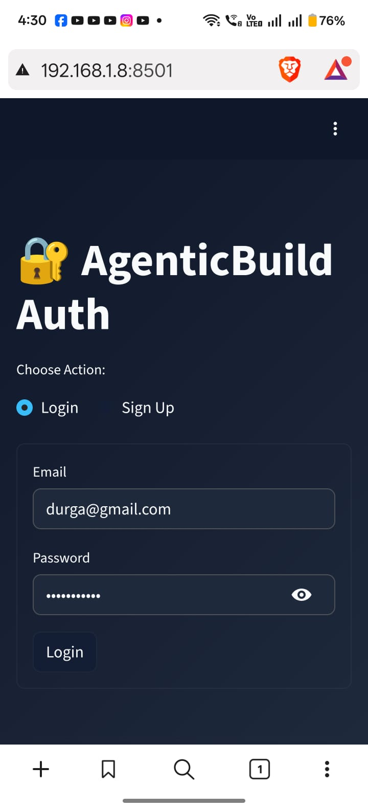
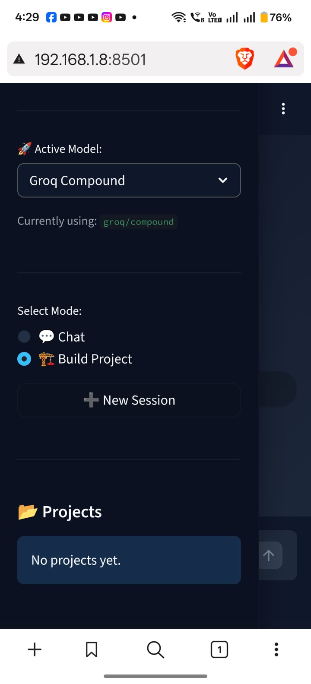

# AgenticBuild 🤖
**Autonomous Full-Stack AI Engineer**

AgenticBuild is an AI-native platform that transforms natural language into production-ready web applications. Unlike traditional "one-shot" generators, it uses **Agentic Loops** powered by LangGraph to architect, implement, and self-correct code until it works.

---

## ✨ Key Features

### 🧠 Intelligent Orchestration
AgenticBuild uses a stateful **Directed Acyclic Graph (DAG)** powered by **LangGraph** to manage the lifecycle of a request.

```mermaid
graph TD
    START((START)) --> Mode{Mode Check}
    Mode -- Chat --> Chat[Chat Node]
    Mode -- Project --> Analyzer[Analyzer Node]
    
    Analyzer --> Feasible{Feasible?}
    Feasible -- No --> Chat
    Feasible -- Yes --> Namer[Namer Node]
    
    Namer --> Architect[Architect Node]
    Architect --> Coder[Coder Node]
    Coder --> Validator[Validator Node]
    
    Validator --> Result{Validation Result}
    Result -- Success --> Writer[Writer Node]
    Result -- Bug Found <br/> Retry < 5 --> Coder
    Result -- Bug Found <br/> Retry >= 5 --> Chat
    
    Writer --> END((END))
    Chat --> END
    
    style START fill:#0f172a,stroke:#38bdf8
    style END fill:#0f172a,stroke:#38bdf8
    style Coder fill:#1e293b,stroke:#38bdf8,stroke-width:2px
    style Validator fill:#1e293b,stroke:#38bdf8,stroke-width:2px
```



- **Self-Healing Code Engine**: Implements a recursive "Test-and-Repair" loop. If the generated code has bugs or formatting issues, the agent detects, analyzes, and fixes them autonomously across multiple retries.
- **LangGraph State Management**: Uses stateful directed acyclic graphs (DAGs) to manage complex multi-step reasoning, ensuring high architectural consistency.
- **Smart Fallback Mechanism**: Automatically pivots from complex multi-file architectures to robust single-file applications if technical constraints (like token limits) are hit.
- **Feasibility Analysis**: Pre-screens every request to ensure it stays within system capabilities, providing **💡 Suggested Alternatives** for non-feasible tasks.

### 🛠️ Advanced Project Management
- **Incremental Updates**: Unlike one-shot generators, AgenticBuild understands your existing codebase. You can request updates, add features, or refactor existing projects through conversational dialogue.
- **Multi-Session Workstreams**: Create and manage multiple concurrent project builds. Switch between different feature branches without losing progress.
- **Dynamic Model Switching**: Hot-swap between different "AI brains" (OpenAI 120B, Llama 4 Scout, Llama 3.3, etc.) at runtime to balance speed, cost, and reasoning power.
- **Native ZIP Exports**: Download your completed projects as ready-to-deploy archives directly from the sidebar.

### 🛡️ Enterprise-Ready Core
- **Multi-Tenant Security**: Built-in JWT authentication ensures that sessions, projects, and history are strictly isolated between users.
- **Context Pruning**: High-efficiency history management and character capping allow the agent to handle large projects without hitting server request size limits.
- **Glassmorphism UI**: A high-end, modern dashboard with blur effects, responsive layouts, and real-time build status tracking.

---

## 🚀 Quick Start

### 1. Setup Environment
```bash
# Install uv (modern package manager)
pip install uv

# Sync dependencies
uv sync
```

### 2. Configure Credentials
Create a `.env` file from `.env.example`:
```env
LLM_PROVIDER=groq
GROQ_API_KEY=your_key_here
GROQ_MODEL_NAME=openai/gpt-oss-120b
```

### 3. Launch AgenticBuild
```bash
uv run python init_and_run.py
```

---

## 🛠️ Development Methodology
AgenticBuild was developed adopting the new era of **AI-First Engineering**, leveraging autonomous agent orchestration to build an autonomous agent platform.

- **Gemini CLI & Superpowers plugin**: This project was architected and stabilized using the Gemini CLI (leveraging the **Gemini 3.1 Pro** model), utilizing the **Superpowers plugin** for deep codebase research and tool integration.
- **Plan & Action Workflow**: The development followed a strict **Research -> Strategy (Plan Mode) -> Execution (Action Mode)** cycle.
- **The Modern Era**: This project serves as a testament to the transition from manual coding to **Agentic Orchestration**—a workflow that demands higher-level system design skills and a focus on responsible, secure AI usage.

---

## 🏗️ Technical Stack
- **Backend**: Python 3.14, FastAPI, SQLModel (SQLite), JWT
- **AI Engine**: LangGraph, LangChain, Groq (OpenAI 120B / Llama 4 / Llama 3.3)
- **Frontend**: Streamlit, LocalStorage API, GSAP, Tailwind CSS
- **Capabilities**: High-fidelity Single-Page Apps (Three.js/GSAP) and Standalone Scripts

---

## 🧹 Individual Execution
If you prefer to run the services separately:
- **Backend**: `uv run uvicorn backend.app.main:app --reload`
- **Frontend**: `uv run streamlit run frontend/app.py`

---

## 🚧 Roadmap & Security (TODO)
- [ ] **UI Stabilization**: Tighten up visual consistency and refine Glassmorphism components.
- [ ] **Filesystem Sandboxing**: Implement containerized sandboxing for the agent's file-writing capabilities.
- [ ] **Adversarial Robustness**: Implement multi-layered scaffolding to detect and block complex prompt injection attacks.
- [ ] **Security Auditing**: Integrate an automated auditor node to scan generated code for vulnerabilities.

---

## 🖼️ Visual Gallery
*Click on any image to view in high resolution.*

<div align="center">
  <a href="docs/assets/screenshots/screenshot-1.jpeg"></a>
  <a href="docs/assets/screenshots/screenshot-2.jpeg"></a>
  <a href="docs/assets/screenshots/screenshot-3.jpeg"></a>
</div>
<br/>
<div align="center">
  <a href="docs/assets/screenshots/screenshot-4.jpeg"></a>
  <a href="docs/assets/screenshots/screenshot-8.jpeg"></a>
  <a href="docs/assets/screenshots/screenshot-9.jpeg"></a>
</div>
<br/>
<div align="center">
  <a href="docs/assets/screenshots/screenshot-6.jpeg"></a>
  <a href="docs/assets/screenshots/screenshot-7.jpeg"></a>
</div>
